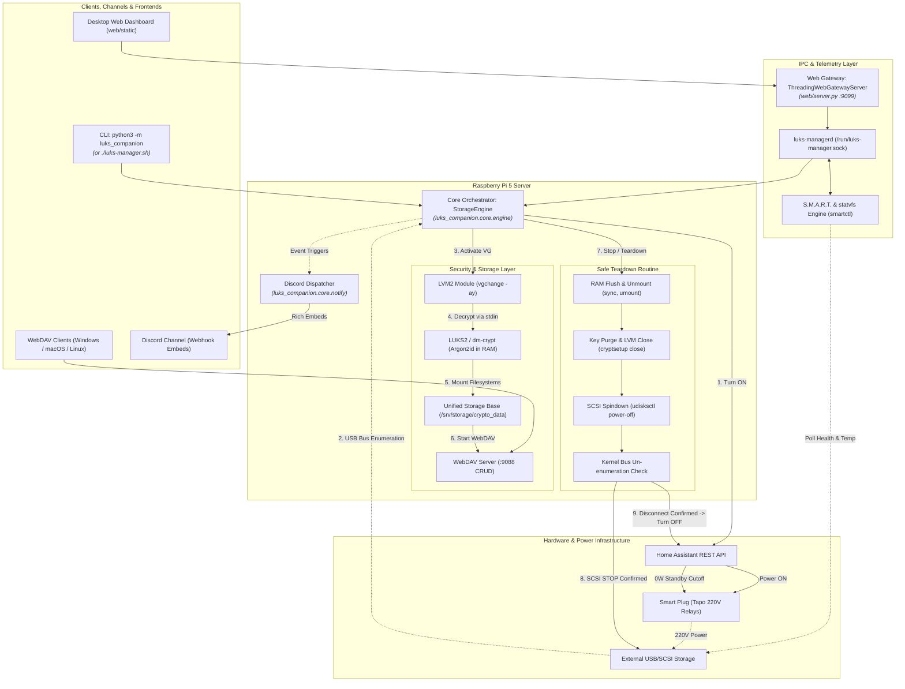

# LUKS Companion 🔒⚡

[](https://www.python.org/)
[](https://www.gnu.org/software/bash/)
[](https://kernel.org/)
[](https://archlinuxarm.org/)
[](https://www.home-assistant.io/)
[](https://gitlab.com/cryptsetup/cryptsetup)
[](LICENSE)

An on-demand, zero-standby-power LUKS2 & LVM storage subsystem orchestrator designed for 24/7 headless Linux servers (such as Raspberry Pi 5).

It combines **Home Assistant REST API smart plug control**, **LVM Volume Group activation**, **RAM-only LUKS2 passphrase & keyfile decryption (`stdin`)**, **lightweight WebDAV sharing**, and **clean SCSI spindown (`udisksctl power-off`)** to achieve true **0 Watt cold storage standby** with safe physical head parking.

> [!NOTE]
> ### 🎯 Destinatari e Prerequisiti di Competenza
> Questo progetto **non è una suite consumer "plug-and-play"** per utenti alle prime armi, ma uno strumento di orchestrazione avanzato pensato per sistemisti, power user e amministratori Linux con già familiarità con:
> - **LUKS2 / dm-crypt** (header crittografici, keyslot Argon2id, mappatura `/dev/mapper/*`).
> - **LVM2** (concetti di *Physical Volumes*, *Volume Groups* e *Logical Volumes*).
> - **Linux Storage & Kernel VFS** (mount point, permessi POSIX, udev, bus SCSI/USB e spindown).
> - **Home Automation** (Home Assistant REST API, switch smart per cut-off elettrico a 220V).
>
> Il software gestisce l'automazione a monte e a valle (alimentazione, bus scan, decifratura in RAM, montaggio ed espulsione SCSI sicura), assumendo che i volumi LVM e i container LUKS siano già stati partizionati e formattati correttamente dall'amministratore.

---

## 📐 Architecture Overview



> [!TIP]
> ### 🗺️ Mappa Interattiva del Ciclo di Vita (v2.0)
> Per esplorare visivamente la macchina a stati completa (gestione fallimenti alimentazione, rilevamento USB, decifratura in RAM, S.M.A.R.T. a 0W, unmount atomico e dis-enumerazione kernel) con zoom, ricerca e cassetto dettagli:
> * 🌐 **Live Preview Web**: 👉 <a href="https://htmlpreview.github.io/?https://github.com/a-cifrodelli/luks-companion/blob/main/docs/luks_manager_flowchart.html" target="_blank">**Apri il Flowchart Interattivo su htmlpreview.github.io**</a>
> * 💻 **In locale / Clone**: Apri il file <a href="docs/luks_manager_flowchart.html" target="_blank">`docs/luks_manager_flowchart.html`</a> direttamente nel browser (o dalla Web Dashboard tramite il pulsante *🗺️ Architettura*).

> [!IMPORTANT]
> **Active Safety Verification**: Before sending the 220V power cutoff command to Home Assistant, `luks-manager` actively queries the Linux kernel `/sys/block/` tree and device node table until kernel un-enumeration is 100% confirmed. This guarantees that SCSI head parking and USB bus ejection are complete before turning off the outlet.

---

## ✨ Features

- 🔋 **0 Watt Standby Consumption**: Cuts 220V power via Home Assistant smart plug automation when not in use.
- 🛡️ **Hardware Preservation**: Uses SCSI `START STOP UNIT` (`udisksctl power-off`) and active kernel un-enumeration polling to safely park heads on landing ramps before 220V power cut.
- 🔑 **Strict RAM Hygiene**: Passphrases and keyfiles are read via `stdin` (`--key-file -`) directly into kernel memory (`dm-crypt`). Never written to disk, CLI args, or shell history.
- 🖼️ **In-Browser Steganography**: Embed and extract 4096-bit keys into/from normal photos directly inside the browser using the Web Crypto API.
- 📦 **LVM2 + LUKS2 Support**: Handles complex multi-volume LVM setups containing both encrypted and plain partitions.
- 🌐 **Dedicated Socket Daemon (`daemon/`)**: Provides a non-root UNIX domain socket (`/run/luks-manager.sock`) for seamless Web App integration.
- 📊 **Live Telemetry & S.M.A.R.T. Health**: Real-time volume capacity progress bars, drive temperature (`°C`), and hardware integrity checks via `smartctl`.
- 🔔 **Discord Webhook Notifications**: Real-time rich embeds on storage unlock, safe lock/spindown, watchdog inactivity timeout, or system errors (100% zero overhead if disabled).
- 📁 **Lightweight WebDAV Subsystem**: Native image/video thumbnail support serving the decrypted storage directly.

---

## 🛠️ Prerequisites

Ensure your Linux host has the required utilities installed:

### On Arch Linux ARM
```bash
sudo pacman -S --needed cryptsetup lvm2 udisks2 psmisc curl socat python smartmontools
```

### On Debian / Raspberry Pi OS
```bash
sudo apt update && sudo apt install -y cryptsetup lvm2 udisks2 psmisc curl socat python3 smartmontools
```

> [!TIP]
> **Rilevamento del binario `smartctl`**:
> Il demone rileva automaticamente `smartctl` dal `$PATH` di sistema o cercandolo nei percorsi standard (`/usr/sbin/smartctl`, `/usr/bin/smartctl`, `/sbin/smartctl`, `/bin/smartctl`).
> * Su Arch Linux ARM il binario è posizionato in `/usr/bin/smartctl`.
> * Su Debian / Ubuntu / Raspberry Pi OS è posizionato in `/usr/sbin/smartctl`.
>
> In caso di box o bridge USB/SATA esterni, `luks-managerd` interroga automaticamente gli attributi S.M.A.R.T. e la temperatura in formato JSON nativo (`smartctl -j -i -H -A /dev/sdX`). Se il bridge USB non espone i comandi ATA pass-through, il sistema degrada elegantemente senza bloccare l'interfaccia.

---

## 🚀 Installation & Setup

1. **Clone the repository**:
   ```bash
   git clone https://github.com/a-cifrodelli/luks-companion.git
   cd luks-companion
   ```

2. **Configure your environment**:
   Copy `.env.example` to `.env` and fill in your parameters (or run `./scripts/update-env.sh` to sync missing variables into an existing `.env`):
   ```bash
   cp .env.example .env
   nano .env
   chmod 600 .env
   ```

3. **Make scripts executable**:
   ```bash
   chmod +x luks-manager.sh daemon/install.sh web/install.sh scripts/install-webdav.sh scripts/update-env.sh scripts/notify-discord.sh scripts/notify-discord.py
   ```

---

## 💻 CLI Usage (`luks-companion`)

La nuova CLI unificata in Python fornisce controllo completo, diagnostica dettagliata ed elevazione automatica dei permessi.

> [!TIP]
> **Retrocompatibilità**: Puoi continuare a usare `./luks-manager.sh` come di consueto; reindirizzerà automaticamente a `python3 -m luks_companion`.

### 1. Avvio Interattivo (Start / Unlock)
Accende la presa, rileva il disco USB, attiva LVM, sblocca LUKS2 via prompt passphrase o `--keyfile`, monta i filesystem, avvia WebDAV ed entra nel monitor watchdog:
```bash
python3 -m luks_companion start
# oppure con keyfile:
python3 -m luks_companion start --keyfile /percorso/chiave.bin
# oppure con il wrapper retrocompatibile:
./luks-manager.sh start
```
*Premi `[INVIO]` in qualsiasi momento per avviare il teardown sicuro e lo spegnimento.*

### 2. Arresto Immediato (Stop / Lock)
Esegue la sequenza atomica di teardown in 8 passi (stop WebDAV, sync, unmount, distruzione chiave LUKS in RAM, disattivazione LVM, parcheggio testine SCSI e cutoff 220V):
```bash
python3 -m luks_companion stop
```

### 3. Verifica Stato (Status)
Mostra lo stato istantaneo dello storage, della presa smart e della telemetria S.M.A.R.T.:
```bash
python3 -m luks_companion status
# Formato JSON per script esterni:
python3 -m luks_companion status --json
```

### 4. Check-up Diagnostico Trasparente (Diagnose)
Elimina ogni opacità ("fare il rabdomante") in caso di errori: scansiona permessi, connettività Home Assistant, dischi fisici USB, LVM, container LUKS, mountpoint e servizi systemd con report dettagliato e suggerimenti d'azione immediati:
```bash
python3 -m luks_companion diagnose
```

### 5. Disaster Recovery Header LUKS2 (Backup & Restore)
Esegue il backup dei metadati LUKS2 in un file locale sicuro o ne ripristina uno precedentemente salvato:
```bash
# Backup header
python3 -m luks_companion backup-header --out /root/backup_header.bin

# Ripristino header (richiede conferma esplicita e volume chiuso)
python3 -m luks_companion restore-header /root/backup_header.bin
```

### 6. Notifiche Discord da CLI (Notify)
Invia notifiche diagnostiche o di test su Discord con embed grafici di telemetria:
```bash
# Test connettività webhook
python3 -m luks_companion notify test

# Notifica personalizzata
python3 -m luks_companion notify unlock "Sblocco storage autorizzato da terminale"
```

---

## 🧪 Suite di Test Automatica (`run_tests.py`)

Il progetto include una suite completa di **34 unit test** (`pytest`) suddivisi in 9 moduli, eseguibile istantaneamente su qualsiasi macchina (anche in ambiente di sviluppo locale Windows o Linux senza dischi fisici collegati):
```bash
python run_tests.py
```
Copre al 100%:
* Atomicità ed idempotenza del Teardown in tutti gli scenari d'errore (fallimento presa HA, mancato rilevamento USB, password errata, doppio stop consecutivo).
* Sequenza di avvio, sblocco da RAM buffer e montaggio volumi.
* Diagnostica di sistema e rilevamento anomalie.
* Monitoraggio I/O del Watchdog e trigger di inattività.
* Conformità del Privilege Dropping POSIX.
* Telemetria S.M.A.R.T. SAT e rilevamento Standby a 0W.
* Caching ad alta efficienza per l'API Home Assistant (TTL 2s per azzerare il carico sul server domotico).
* Streaming NDJSON per i log interattivi e concorrenza multi-thread (`ThreadingWebGatewayServer`).

---

## 🌐 Socket Daemon & Web Dashboard (Privilege Separation)

L'architettura separa rigorosamente i privilegi:
- **Master Daemon (`luks-managerd.service`)**: Gira come `root` per gestire i dispositivi a blocchi, LVM e LUKS, ascoltando su `/run/luks-manager.sock` con permessi ristretti `0660 root:luks-web`.
- **Web Dashboard Gateway (`luks-web.service`)**: Gira come utente non privilegiato `luks-web`, servendo l'interfaccia grafica e comunicando con il socket IPC.

### 1. Installazione Demone Master (Root IPC)
```bash
sudo ./daemon/install.sh
```

### 2. Installazione Web Dashboard (Default: Porta 9099)
```bash
sudo ./web/install.sh
```
La dashboard HTTP si avvia sulla porta configurata in `.env` (`WEB_PORT=9099`):
* **Accesso diretto HTTP**: `http://<IP_DEL_SERVER>:9099`
* **Terminazione TLS / HTTPS**: Per esporla su HTTPS, configura un reverse proxy (Nginx, Caddy, Traefik) verso `http://127.0.0.1:9099`. (Vedi [docs/web.md](docs/web.md)).

---

## 🔔 Notifiche Discord (Webhook)

LUKS Companion supporta l'invio automatico di notifiche con embed ricchi su un canale Discord per tenere traccia dello stato di sicurezza dello storage:

1. **Configurazione in `.env`**:
   Imposta la variabile `DISCORD_WEBHOOK_URL`:
   ```bash
   DISCORD_WEBHOOK_URL="https://discord.com/api/webhooks/1234567890/abcdefghijklmnopqrstuvwxyz"
   ```
   > [!NOTE]
   > **Sicurezza & Zero Overhead**: Se `DISCORD_WEBHOOK_URL` è vuota, commentata o non presente nel file `.env`, il modulo di notifica viene saltato istantaneamente (`exit 0`), senza effettuare alcuna chiamata di rete o introdurre ritardi.

2. **Eventi notificati automaticamente**:
   * 🔓 **Sblocco**: Quando il volume viene decifrato in RAM e montato con successo (con dettagli Host, Volume Group, Mount point, WebDAV).
   * 🛑 **Arresto / Lock**: Quando i volumi vengono smontati, la chiave cancellata dalla memoria e il disco spento (0W).
   * ⏱️ **Watchdog per Inattività**: Quando il timer di inattività scade ed espelle lo storage.
   * ⚠️ **Errori**: In caso di tentativi falliti o anomalie hardware sul bus USB.

3. **Test manuale del Webhook**:
   ```bash
   # Tramite CLI unificata:
   python3 -m luks_companion notify test

   # Oppure tramite gli script wrapper:
   ./scripts/notify-discord.sh test
   ./scripts/notify-discord.py test
   ```

---

## 📄 License

Distributed under the MIT License. See `LICENSE` for details.
