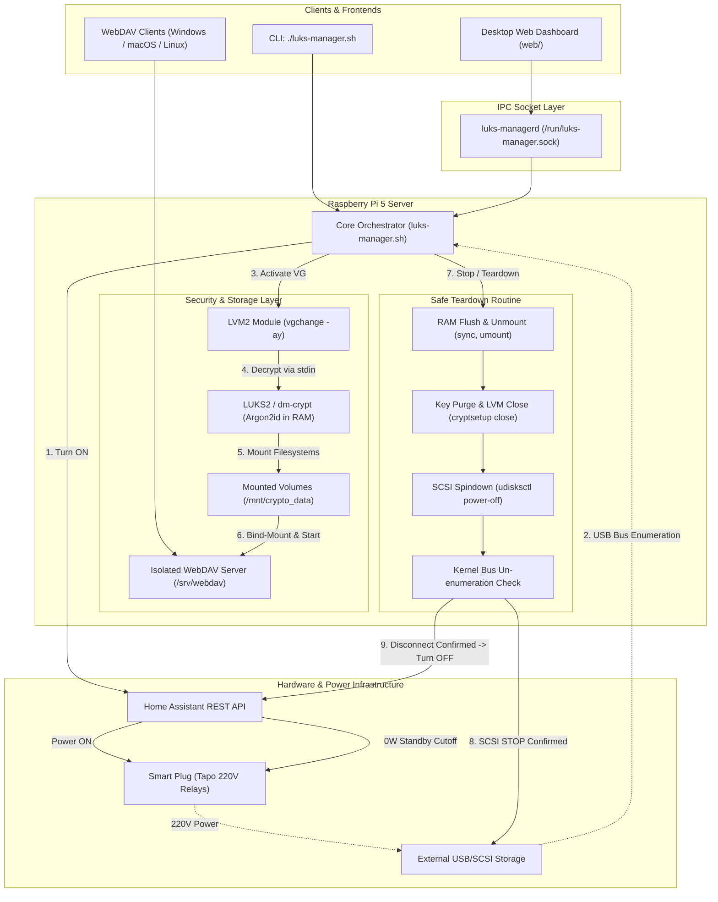

# LUKS Companion 🔒⚡

[](https://www.gnu.org/software/bash/)
[](https://kernel.org/)
[](https://archlinuxarm.org/)
[](https://www.home-assistant.io/)
[](https://gitlab.com/cryptsetup/cryptsetup)
[](LICENSE)

An on-demand, zero-standby-power LUKS2 & LVM storage subsystem orchestrator designed for 24/7 headless Linux servers (such as Raspberry Pi 5).

It combines **Home Assistant REST API smart plug control**, **LVM Volume Group activation**, **RAM-only LUKS2 passphrase & keyfile decryption (`stdin`)**, **lightweight WebDAV sharing**, and **clean SCSI spindown (`udisksctl power-off`)** to achieve true **0 Watt cold storage standby** with safe physical head parking.

> [!NOTE]
> ### 🎯 Destinatari e Prerequisiti di Competenza
> Questo progetto **non è una suite consumer "plug-and-play"** per utenti alle prime armi, ma uno strumento di orchestrazione avanzato pensato per sistemisti, power user e amministratori Linux con già familiarità con:
> - **LUKS2 / dm-crypt** (header crittografici, keyslot Argon2id, mappatura `/dev/mapper/*`).
> - **LVM2** (concetti di *Physical Volumes*, *Volume Groups* e *Logical Volumes*).
> - **Linux Storage & Kernel VFS** (mount point, permessi POSIX, udev, bus SCSI/USB e spindown).
> - **Home Automation** (Home Assistant REST API, switch smart per cut-off elettrico a 220V).
>
> Il software gestisce l'automazione a monte e a valle (alimentazione, bus scan, decifratura in RAM, montaggio ed espulsione SCSI sicura), assumendo che i volumi LVM e i container LUKS siano già stati partizionati e formattati correttamente dall'amministratore.

---

## 📐 Architecture Overview



> [!IMPORTANT]
> **Active Safety Verification**: Before sending the 220V power cutoff command to Home Assistant, `luks-manager` actively queries the Linux kernel `/sys/block/` tree and device node table until kernel un-enumeration is 100% confirmed. This guarantees that SCSI head parking and USB bus ejection are complete before turning off the outlet.

---

## ✨ Features

- 🔋 **0 Watt Standby Consumption**: Cuts 220V power via Home Assistant smart plug automation when not in use.
- 🛡️ **Hardware Preservation**: Uses SCSI `START STOP UNIT` (`udisksctl power-off`) and active kernel un-enumeration polling to safely park heads on landing ramps before 220V power cut.
- 🔑 **Strict RAM Hygiene**: Passphrases and keyfiles are read via `stdin` (`--key-file -`) directly into kernel memory (`dm-crypt`). Never written to disk, CLI args, or shell history.
- 🖼️ **In-Browser Steganography**: Embed and extract 4096-bit keys into/from normal photos directly inside the browser using the Web Crypto API.
- 📦 **LVM2 + LUKS2 Support**: Handles complex multi-volume LVM setups containing both encrypted and plain partitions.
- 🌐 **Dedicated Socket Daemon (`daemon/`)**: Provides a non-root UNIX domain socket (`/run/luks-manager.sock`) for seamless Web App integration.
- 🖥️ **Desktop Web Dashboard (`web/`)**: Clean, responsive UI with real-time status, 3 unlock methods, and safe eject button.
- 📁 **Lightweight WebDAV Subsystem**: Native image/video thumbnail support with isolated bind-mount directory scoping (`/srv/webdav`).

---

## 🛠️ Prerequisites

Ensure your Linux host has the required utilities installed:

### On Arch Linux ARM
```bash
sudo pacman -S --needed cryptsetup lvm2 udisks2 psmisc curl socat python
```

### On Debian / Raspberry Pi OS
```bash
sudo apt update && sudo apt install -y cryptsetup lvm2 udisks2 psmisc curl socat python3
```

---

## 🚀 Installation & Setup

1. **Clone the repository**:
   ```bash
   git clone https://github.com/your-username/luks-companion.git
   cd luks-companion
   ```

2. **Configure your environment**:
   Copy `.env.example` to `.env` and fill in your parameters (or run `./scripts/update-env.sh` to sync missing variables into an existing `.env`):
   ```bash
   cp .env.example .env
   nano .env
   chmod 600 .env
   ```

3. **Make scripts executable**:
   ```bash
   chmod +x luks-manager.sh test_ha_tapo.sh daemon/install.sh web/install.sh scripts/install-webdav.sh scripts/update-env.sh
   ```

---

## 💻 CLI Usage

The core script `luks-manager.sh` supports atomic subcommands:

### 1. Avvio Interattivo (Start / Unlock)
Powers on the plug, activates LVM, decrypts LUKS via interactive passphrase prompt, mounts filesystems, starts WebDAV, and enters the idle watchdog loop:
```bash
./luks-manager.sh
# oppure: ./luks-manager.sh start
```
*Press `[ENTER]` at any time to initiate safe teardown and power cutoff.*

### 2. Arresto Immediato (Stop / Lock)
Safely stops WebDAV, unmounts filesystems, seals LUKS, deactivates LVM, parks drive heads, and cuts 220V power:
```bash
./luks-manager.sh stop
```

### 3. Verifica Stato (Status)
Inspects live power, LVM, LUKS, mount, and WebDAV state:
```bash
./luks-manager.sh status
```

---

## 🌐 Socket Daemon & Web Dashboard

### 1. Avvio del Demone Socket (Root IPC)
```bash
sudo ./daemon/install.sh
```

### 2. Avvio della Web Dashboard (Default: Porta 9099)
```bash
sudo ./web/install.sh
```
La dashboard HTTP si avvia sulla porta configurata in `.env` (`WEB_PORT=9099`):
* **Accesso diretto HTTP**: `http://<IP_DEL_SERVER>:9099`
* **Terminazione TLS / HTTPS**: Se desideri esporla su HTTPS con certificato SSL, configura il tuo reverse proxy preferito (Traefik, Nginx, Caddy, Apache) inoltrando le richieste verso `http://127.0.0.1:9099`. (Vedi [docs/web.md](docs/web.md) per dettagli ed esempi).

---

## 📄 License

Distributed under the MIT License. See `LICENSE` for details.
