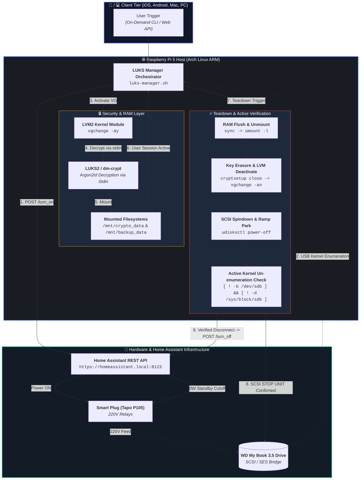

# LUKS Manager 🔒⚡

[](https://www.gnu.org/software/bash/)
[](https://kernel.org/)
[](https://archlinuxarm.org/)
[](https://www.home-assistant.io/)
[](https://gitlab.com/cryptsetup/cryptsetup)
[](LICENSE)

An on-demand, zero-standby-power LUKS2 & LVM storage subsystem orchestrator designed for 24/7 headless Linux servers (such as Raspberry Pi 5).

It combines **Home Assistant REST API smart plug control**, **LVM Volume Group activation**, **RAM-only LUKS2 passphrase decryption (`stdin`)**, and **clean SCSI spindown (`udisksctl power-off`)** to achieve true **0 Watt cold storage standby** with safe physical head parking.

---

## 📐 Architecture Overview



> [!IMPORTANT]
> **Active Safety Verification**: Before sending the 220V power cutoff command to Home Assistant, `luks-manager` actively queries the Linux kernel `/sys/block/` tree and device node table until kernel un-enumeration is 100% confirmed. This guarantees that SCSI head parking and USB bus ejection are complete before turning off the outlet.

---

## ✨ Features

- 🔋 **0 Watt Standby Consumption**: Cuts 220V power via Home Assistant smart plug automation when not in use.
- 🛡️ **Hardware Preservation**: Uses SCSI `START STOP UNIT` (`udisksctl power-off`) and active kernel un-enumeration polling to safely park heads on landing ramps before 220V power cut.
- 🔑 **Strict RAM Hygiene**: Passphrase is read via `stdin` (`--key-file -`) directly into kernel memory (`dm-crypt`). Never written to disk, CLI args, or shell history.
- 📦 **LVM2 + LUKS2 Support**: Handles complex multi-volume LVM setups containing both encrypted and plain partitions.
- 🌐 **Decoupled Home Assistant Integration**: Communicates via standard HTTPS REST API using Long-Lived Access Tokens.
- ⚙️ **Fully Configurable**: All credentials, paths, entity IDs, and timeouts are stripped into `.env`.

---

## 🛠️ Prerequisites

Ensure your Linux host has the required utilities installed:

### On Arch Linux ARM
```bash
sudo pacman -S --needed cryptsetup lvm2 udisks2 psmisc curl
```

### On Debian / Raspberry Pi OS
```bash
sudo apt update && sudo apt install -y cryptsetup lvm2 udisks2 psmisc curl
```

---

## 🚀 Installation & Setup

1. **Clone the repository**:
   ```bash
   git clone https://github.com/your-username/luks-manager.git
   cd luks-manager
   ```

2. **Configure your environment**:
   Copy `.env.example` to `.env` and fill in your Home Assistant URL, token, entity ID, and LVM names:
   ```bash
   cp .env.example .env
   nano .env
   ```

3. **Make scripts executable**:
   ```bash
   chmod +x luks-manager.sh test_ha_tapo.sh
   ```

---

## 🧪 Unit Testing Home Assistant Integration

Before mounting drives, verify your Home Assistant connection and smart plug entity ID:

```bash
./test_ha_tapo.sh
```

---

## 💻 Usage

Run the main orchestrator script:

```bash
./luks-manager.sh
```

### Workflow Execution Steps:
1. **Power-ON**: Calls HA REST API to power on the smart plug.
2. **Device Detection**: Waits for Linux kernel udev to detect the USB storage device.
3. **LVM Activation**: Runs `vgchange -ay <VG_NAME>`.
4. **LUKS Decryption**: Prompts for your passphrase securely without echoing.
5. **Mount**: Mounts encrypted and plain volumes to `/mnt/...`.
6. **Active Session**: Keeps volume available for file sharing. Press `[ENTER]` when done.
7. **Safe Teardown**: Flushes RAM buffers (`sync`), unmounts filesystems, closes LUKS, deactivates LVM VGs, parks SCSI heads (`udisksctl power-off`), verifies device un-enumeration in `/sys/block/`, and powers OFF the 220V smart plug via Home Assistant (0W).

---

## 🔒 Security Best Practices

> [!TIP]
> Always restrict permissions on your `.env` file to prevent local user reading:
> ```bash
> chmod 600 .env
> ```

- Never commit your `.env` file! It is ignored by `.gitignore`.
- Use a Home Assistant **Long-Lived Access Token** restricted to the required entity scope if possible.

---

## 📄 License

Distributed under the MIT License. See `LICENSE` for details.
