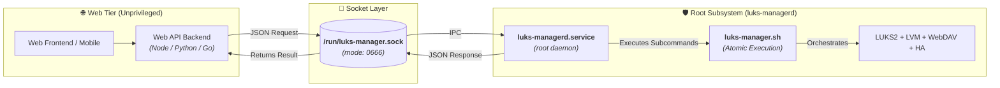

# UNIX Domain Socket Daemon Guide 🔌

This document describes the architecture, installation, API specification, and integration patterns for the **LUKS Manager Socket Daemon** (`daemon/luks-managerd.py`).

---

## 🎯 Purpose & Architecture

In modern home servers and NAS appliances, Web interfaces (e.g. FastAPI, Node.js, Next.js, Flask) often run as unprivileged users (e.g. `www-data`, `http`, or `nobody`). 

Granting these unprivileged web processes full `sudo` access or storing SSH root keys on the webserver introduces severe security risks.

The **LUKS Manager Socket Daemon** solves this by listening on a local **UNIX Domain Socket** (`/run/luks-manager.sock`) configured with `0666` permissions:



---

## 🚀 Installation & Management

### Automated Installation
To install and start the systemd service:

```bash
sudo ./daemon/install.sh
```

### Checking Service Status
```bash
sudo systemctl status luks-managerd.service
```

### Viewing Daemon Logs
```bash
journalctl -u luks-managerd.service -f
```

---

## 📡 API Specification

All requests and responses are standard JSON objects transmitted over the UNIX Domain Socket `/run/luks-manager.sock`.

### 1. `status` — Query Storage Subsystem State

#### Request
```json
{
  "action": "status"
}
```

#### Response
```json
{
  "status": "ok",
  "data": {
    "status": "mounted",
    "unlocked": true,
    "mounted": true,
    "vg_active": true,
    "webdav_active": true,
    "webdav_port": "9088",
    "vg_name": "vg_nas",
    "mapper_name": "crypto_data",
    "mount_crypto": "/srv/storage/crypto_data",
    "volumes": [
      {
        "name": "Dati Cifrati (crypto_data)",
        "mountpoint": "/srv/storage/crypto_data",
        "total_bytes": 1968840245248,
        "used_bytes": 247839211520,
        "free_bytes": 1721001033728,
        "used_percent": 12.6,
        "total_human": "1.8 TB",
        "used_human": "230.8 GB",
        "free_human": "1.6 TB"
      }
    ],
    "smart": {
      "supported": true,
      "installed": true,
      "device": "/dev/sdb",
      "health": "PASSED",
      "temperature_c": 36,
      "model": "WDC WD20EZAZ-00GGJB0",
      "serial": "WD-WCC4N1EXAMPLE"
    },
    "smartctl_installed": true
  }
}
```

| Field | Type | Description |
| :--- | :--- | :--- |
| `status` | string | Overall state: `"mounted"`, `"unlocked"`, or `"stopped"`. |
| `unlocked` | boolean | `true` if `/dev/mapper/<MAPPER_NAME>` is active in RAM. |
| `mounted` | boolean | `true` if the mount point is mounted. |
| `vg_active` | boolean | `true` if the LVM Volume Group is activated in the kernel. |
| `webdav_active` | boolean | `true` if `webdav.service` is active. |
| `volumes` | array | Live storage metrics per mounted volume (`used_percent`, human sizes, bytes). |
| `smart` | object | Hardware S.M.A.R.T. health, drive temperature, model and serial. |
| `smartctl_installed` | boolean | `true` if `smartctl` is detected on the system PATH or standard binary dirs. |

---

### 2. `unlock` — Power On, Decrypt & Mount

#### Request
```json
{
  "action": "unlock",
  "passphrase": "your_secure_passphrase"
}
```

#### Response (Success)
```json
{
  "status": "ok",
  "message": "Volume sbloccato e montato con successo",
  "output": "[1/7] Invio comando...\n[✓] Disco operativo...",
  "data": {
    "status": "mounted",
    "unlocked": true,
    "mounted": true,
    "webdav_active": true,
    "vg_name": "vg_nas",
    "mapper_name": "crypto_data",
    "mount_crypto": "/mnt/crypto_data"
  }
}
```

#### Response (Error)
```json
{
  "status": "error",
  "message": "[!] ERRORE: Passphrase LUKS errata.",
  "data": {
    "status": "stopped",
    "unlocked": false,
    "mounted": false,
    "webdav_active": false
  }
}
```

---

### 3. `stop` — Safe Teardown & Power Cutoff

#### Request
```json
{
  "action": "stop"
}
```

#### Response
```json
{
  "status": "ok",
  "message": "Procedura di teardown e spegnimento completata",
  "output": "[*] Esecuzione procedura di arresto...\n[✓] ARRESTO COMPLETATO CON SUCCESSO!",
  "data": {
    "status": "stopped",
    "unlocked": false,
    "mounted": false,
    "webdav_active": false
  }
}
```

---

## 💻 Client Integration Examples

### 1. Command Line with `socat`
> [!TIP]
> Use `-t 30` with `socat` so it waits for the server response before closing the connection:

```bash
# Query status
echo '{"action": "status"}' | socat -t 30 - UNIX-CONNECT:/run/luks-manager.sock

# Unlock storage
echo '{"action": "unlock", "passphrase": "my_password"}' | socat -t 60 - UNIX-CONNECT:/run/luks-manager.sock

# Stop storage
echo '{"action": "stop"}' | socat -t 30 - UNIX-CONNECT:/run/luks-manager.sock
```

---

### 2. Python (Standard Library)
```python
import socket
import json

def call_luks_daemon(action: str, passphrase: str = None) -> dict:
    req = {"action": action}
    if passphrase:
        req["passphrase"] = passphrase

    with socket.socket(socket.AF_UNIX, socket.SOCK_STREAM) as sock:
        sock.connect("/run/luks-manager.sock")
        sock.sendall(json.dumps(req).encode('utf-8'))
        
        # Read full response
        chunks = []
        while True:
            chunk = sock.recv(4096)
            if not chunk:
                break
            chunks.append(chunk)
            
    return json.loads(b"".join(chunks).decode('utf-8'))

# Example usage:
print(call_luks_daemon("status"))
```

---

### 3. Node.js / TypeScript
```javascript
const net = require('net');

function sendDaemonCommand(payload) {
  return new Promise((resolve, reject) => {
    const client = net.createConnection('/run/luks-manager.sock', () => {
      client.write(JSON.stringify(payload));
    });

    let rawData = '';
    client.on('data', (data) => {
      rawData += data.toString();
    });

    client.on('end', () => {
      try {
        resolve(JSON.parse(rawData));
      } catch (err) {
        reject(err);
      }
    });

    client.on('error', (err) => reject(err));
  });
}

// Example usage:
sendDaemonCommand({ action: 'status' }).then(console.log);
```

---

## 🔍 Troubleshooting: Broken Pipe (`[Errno 32] Broken pipe`)

### What causes it?
If a command-line client (like `nc` or `socat` without `-t`) closes its side of the connection immediately after sending data, the client is no longer waiting for the response. When `luks-managerd` finishes the unlock/stop routine and attempts to send the JSON response back across the closed connection, the operating system raises a `SIGPIPE` / `BrokenPipeError` (Errno 32).

### How it is handled:
The daemon gracefully absorbs `BrokenPipeError` and `ConnectionResetError` without terminating or blocking subsequent client connections. The operation (unlock/mount/stop) still completes successfully on the system.
