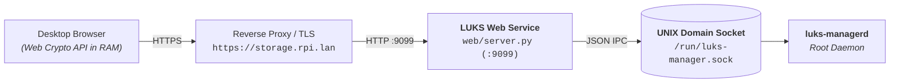

# Web Dashboard Gateway Guide 🖥️

This document describes the setup, architecture, and Traefik reverse proxy integration for the **LUKS Manager Desktop Web Dashboard** (`web/`).

---

## 🎯 Architecture & Security

The Web Dashboard runs as a lightweight, zero-dependency Python service that bridges the local browser interface to the root UNIX domain socket (`/run/luks-manager.sock`).



### Security Features:
- **100% Client-Side Steganography**: Key generation, encryption, and extraction are performed in browser memory via the **Web Crypto API**. Raw photos are never uploaded or stored on the server during creation.
- **Zero Key Persistence**: Passphrases and uploaded keyfiles are held temporarily in client and server RAM and piped directly into kernel memory (`dm-crypt`).
- **HTTP Security Headers**: Native enforcement of `X-Content-Type-Options: nosniff`, `X-Frame-Options: DENY`, and `Cache-Control: no-store`.

---

## 🚀 Installation & Setup

### Automated Installation
```bash
sudo ./web/install.sh
```

### Checking Service Status
```bash
sudo systemctl status luks-web.service
```

### Viewing Logs
```bash
journalctl -u luks-web.service -f
```

---

## 🌐 Traefik Reverse Proxy Configuration

If you run Traefik (e.g. on Arch Linux ARM / Raspberry Pi), you can route your local domain (such as `https://storage.rpi.lan`) directly to `luks-web` on port `9099`.

### Example Dynamic Traefik Configuration (`/etc/traefik/dynamic/luks-web.yaml`):
```yaml
http:
  routers:
    luks-web:
      rule: "Host(`storage.rpi.lan`)"
      service: luks-web-service
      entryPoints:
        - websecure
      tls: {}

  services:
    luks-web-service:
      loadBalancer:
        servers:
          - url: "http://127.0.0.1:9099"
```

---

## 🔑 Dashboard Features & Unlock Modes

1. **🔒 Passphrase**: Standard password prompt for manual unlocking.
2. **📄 Keyfile (.key)**: Direct drag & drop of a 512-byte binary keyfile.
3. **🖼️ Foto Stenografica**: Drag & drop any steganographic photo with an optional secondary password. The browser extracts the key in RAM using PBKDF2/HMAC and submits only the decrypted key bytes.
4. **🎨 Stego Key Studio**: Built-in visual tool in the top header to generate 4096-bit CSPRNG keys, embed them into any photo, and download both `vault.key` and `stego_image.jpg` completely client-side.
