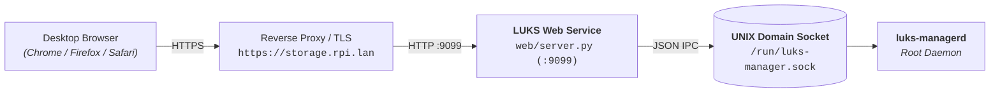

# Web Dashboard Gateway Guide 🖥️

This document describes the setup, architecture, and Traefik reverse proxy integration for the **LUKS Manager Desktop Web Dashboard** (`web/`).

---

## 🎯 Architecture & Security

The Web Dashboard runs as a lightweight, zero-dependency Python service that bridges the local browser interface to the root UNIX domain socket (`/run/luks-manager.sock`).



### Security Features:
- **Zero Key Persistence**: Passphrases and uploaded keyfiles are held temporarily in client and server RAM and piped directly into kernel memory (`dm-crypt`).
- **HTTP Security Headers**: Native enforcement of `X-Content-Type-Options: nosniff`, `X-Frame-Options: DENY`, and `Cache-Control: no-store`.
- **Payload Limit**: Strict 10MB upload ceiling to prevent memory denial-of-service.

---

## 🚀 Installation & Setup

### Automated Installation
```bash
sudo ./web/install.sh
```

### Checking Service Status
```bash
sudo systemctl status luks-web.service
```

### Viewing Logs
```bash
journalctl -u luks-web.service -f
```

---

## 🌐 Traefik Reverse Proxy Configuration

If you run Traefik (e.g. on Arch Linux ARM / Raspberry Pi), you can route your local domain (such as `https://storage.rpi.lan`) directly to `luks-web` on port `9099`.

### Example Dynamic Traefik Configuration (`/etc/traefik/dynamic/luks-web.yaml`):
```yaml
http:
  routers:
    luks-web:
      rule: "Host(`storage.rpi.lan`)"
      service: luks-web-service
      entryPoints:
        - websecure
      tls: {}

  services:
    luks-web-service:
      loadBalancer:
        servers:
          - url: "http://127.0.0.1:9099"
```

---

## 🔑 Using the Dashboard

1. Navigate to `http://<RPI_IP>:9099` or your Traefik HTTPS URL.
2. Choose your preferred unlock method:
   - **Passphrase**: Type your LUKS master passphrase.
   - **Keyfile**: Drag and drop your `.key`, `.bin`, or stego-embedded image.
3. Click **🔑 Sblocca Storage**. The system will power on the smart plug, detect the USB drive, activate LVM, decrypt LUKS into RAM, mount the filesystems, and start WebDAV.
4. When finished, click **🛑 Espelli & Spegni 220V** to perform safe unmounting, SCSI head parking, and smart plug cutoff.
