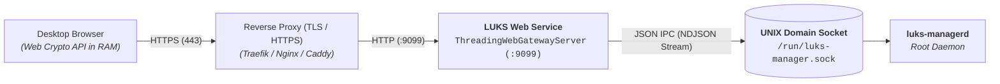
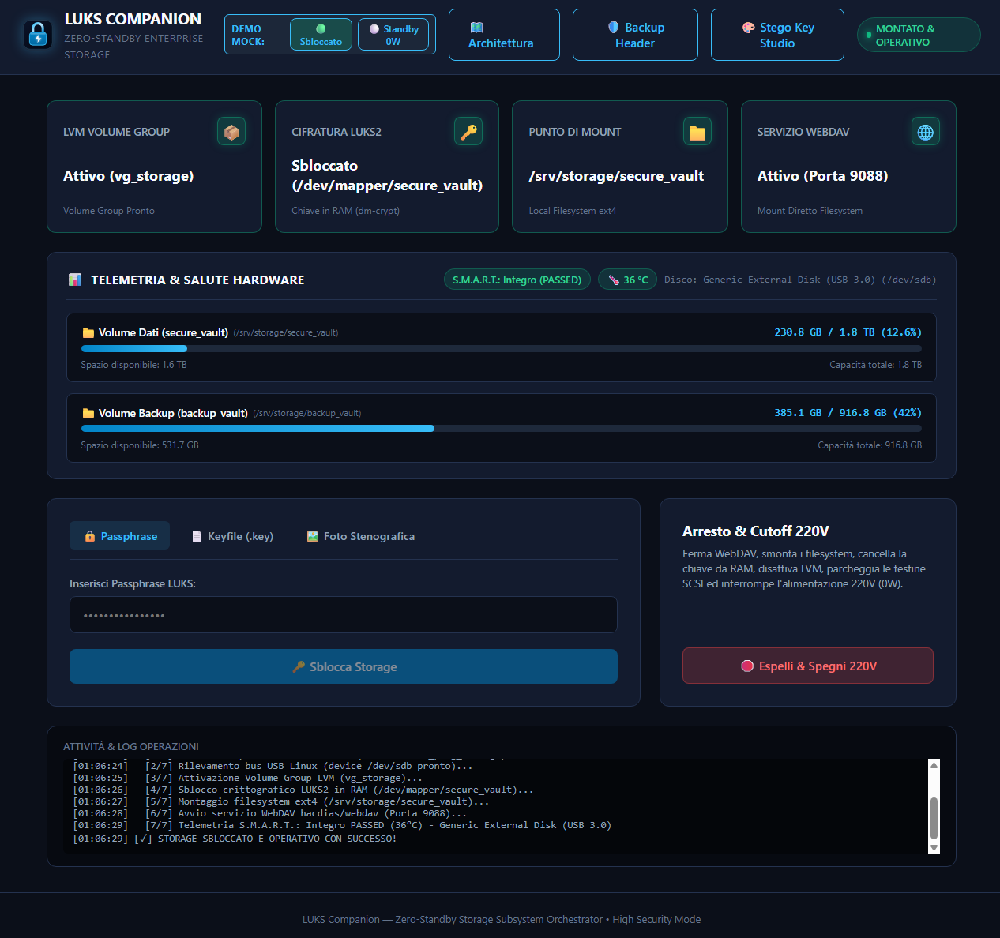
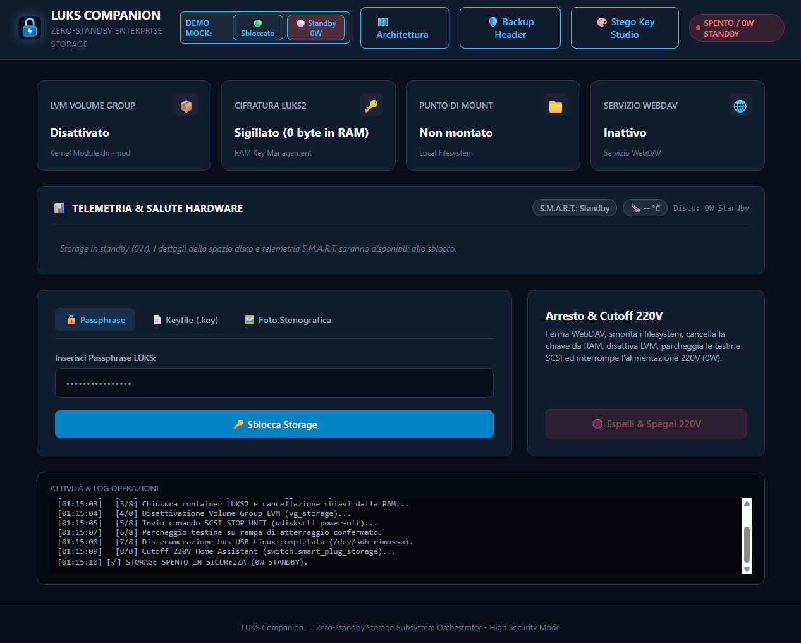
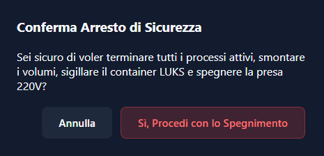

# Web Dashboard Gateway Guide 🖥️

This document describes the setup, configuration, and reverse proxy TLS integration for the **LUKS Manager Desktop Web Dashboard** (`web/`).

---

## 🎯 Architecture & Security

The Web Dashboard runs as a lightweight, zero-dependency Python service that bridges the local browser interface to the root UNIX domain socket (`/run/luks-manager.sock`).



> [!TIP]
> ### 🗺️ Lifecycle Flowchart
> To visually explore the complete orchestrator workflow (from 220V power-on to safe SCSI un-enumeration):
> * 🌐 **Live Web Preview**: <a href="https://htmlpreview.github.io/?https://github.com/a-cifrodelli/luks-companion/blob/main/docs/flowchart/index.html" target="_blank">**Open Flowchart on htmlpreview.github.io**</a>
> * 💻 **Local / Dashboard**: Accessible via `/flowchart` on the Web Gateway or by opening <a href="flowchart/index.html" target="_blank">`docs/flowchart/index.html`</a>.

### Architecture & Security Features:
- **Multi-Threaded Concurrency (`ThreadingWebGatewayServer`)**: Employs daemon worker threads to process incoming HTTP requests and streaming operations concurrently. Page refreshes (`F5`), background status polling, and multi-tab access never stall or raise broken pipe errors.
- **Real-Time NDJSON Streaming**: Storage commands (`/api/command`) use HTTP Chunked Transfer Encoding to stream real-time progress lines directly into the in-browser terminal console.
- **100% Client-Side Steganography**: Key generation, encryption, and extraction are performed in browser memory via the **Web Crypto API**. Raw photos are never uploaded or stored on the server during creation.
- **Zero Key Persistence**: Passphrases and uploaded keyfiles are held temporarily in client and server RAM and piped directly into kernel memory (`dm-crypt`).
- **HTTP Security Headers**: Native enforcement of `X-Content-Type-Options: nosniff`, `X-Frame-Options: DENY`, and `Cache-Control: no-store`.
- **Configurable Port in `.env`**: Port and host are read dynamically from `.env` (`WEB_PORT=9099`, `WEB_HOST=0.0.0.0`).

---

## 📸 Desktop Web Dashboard Interface

### 🟢 Stato Sbloccato & Operativo
Quando il sistema è operativo, la dashboard visualizza lo stato dei Volume Group LVM, il device mapper decifrato in RAM, i mount point ext4, lo stato del servizio WebDAV, la telemetria S.M.A.R.T. (`PASSED`, temperatura a `36°C`), le barre di capienza per ciascun volume e il log in streaming delle operazioni:



### ⚪ Stato Standby 0 Watt (Storage Sigillato & Spento)
In modalità inattiva o a seguito dell'arresto, il container crittografico è sigillato (0 byte di chiavi in RAM), il Volume Group LVM è disattivato, le testine del disco sono parcheggiate in sicurezza e l'alimentazione 220V della presa smart è interrotta (0 Watt):



### 🛑 Arresto Sicuro & Conferma Cutoff 220V
Per prevenire arresti accidentali durante trasferimenti file o sessioni WebDAV attive, la dashboard richiede una conferma esplicita prima di innescare la sequenza di teardown a 8 fasi:



---

## 🚀 Installation & Setup

### Automated Installation
```bash
sudo ./web/install.sh
```

### Checking Service Status
```bash
sudo systemctl status luks-web.service
```

### Viewing Logs
```bash
journalctl -u luks-web.service -f
```

---

## 🌐 TLS / HTTPS Reverse Proxy Integration

The `luks-web` service runs plain HTTP locally on the port configured in `.env` (default `9099`).

To terminate TLS / HTTPS with your custom domain and SSL certificate, configure your reverse proxy of choice to forward to `http://127.0.0.1:9099`.

### Option A: Traefik Dynamic File (`/etc/traefik/dynamic/luks-web.yaml`)
```yaml
http:
  routers:
    luks-web:
      rule: "Host(`storage.your-domain.lan`)"
      service: luks-web-service
      entryPoints:
        - websecure
      tls: {}

  services:
    luks-web-service:
      loadBalancer:
        servers:
          - url: "http://127.0.0.1:9099"
```

### Option B: Nginx (`/etc/nginx/sites-available/luks-web`)
```nginx
server {
    listen 443 ssl http2;
    server_name storage.your-domain.lan;

    ssl_certificate /etc/ssl/certs/storage.crt;
    ssl_certificate_key /etc/ssl/certs/storage.key;

    location / {
        proxy_pass http://127.0.0.1:9099;
        proxy_set_header Host $host;
        proxy_set_header X-Real-IP $remote_addr;
        proxy_set_header X-Forwarded-For $proxy_add_x_forwarded_for;
        proxy_set_header X-Forwarded-Proto $scheme;
    }
}
```

### Option C: Caddy (`/etc/caddy/Caddyfile`)
```caddy
storage.your-domain.lan {
    reverse_proxy 127.0.0.1:9099
}
```

---

## 🔑 Dashboard Features & Unlock Modes

1. **🔒 Passphrase**: Prompt per inserimento manuale protetto della passphrase LUKS.
2. **📄 Keyfile (.key)**: Drag & drop diretto di file binari ad alta entropia (512 byte).
3. **🖼️ Foto Stenografica**: Drag & drop di qualsiasi foto contenente chiavi cifrate con estrazione in RAM (Web Crypto API).
4. **🎨 Stego Key Studio**: Generatore integrato di chiavi CSPRNG 4096-bit con embedding visuale ed esportazione client-side senza comunicare col server:
5. **💾 Backup Header LUKS2**: Generazione e download con un click di un dump atomico dell'header crittografico:
6. **⚠️ Disaster Recovery (Ripristino Header)**: Modale di soccorso per ripristinare un header su storage corrotto con salvaguardia dei blocchi: